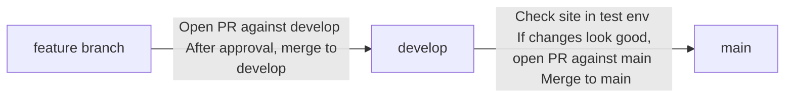

# Surge NFT Passport

---

## Local Development

### Running Locally in a Docker Container (_recommended_)

1. Install [Docker Desktop](https://docs.docker.com/desktop/mac/install/). (You do not need to create an account in order to use Docker.)
2. Run the following command:
   ```
   docker-compose up
   ```

Open http://localhost:3000 to view app in the browser.

This simulates how the app will be built in production.
This workflow builds from the package-lock.json file using `npm ci`.
If any dependencies change, you will need to run `npm install` separately to update the lock file before running `docker-compose up`.

#### Troubleshooting Docker

`docker-compose up` does not rebuild images before starting up a container to save time.
If you are having issues with your container or certain changes are not propagating, then run
`docker-compose up --build --force-recreate`. This will rebuild the image and recreate the container.

### Running Locally using NPM

1. `npm install` to install all dependencies

### Available Scripts

```
npm run compile # compile the contracts
npm run start   # start the front end
npm run test    # run tests on contracts and front end
npm run format  # run prettier
```

## Deployment

For our merge and deployment process, we are following a variation of the [Gitflow branching model](https://www.gitkraken.com/learn/git/git-flow).
The `develop` branch represents our test environment and the `main` branch represents our prod environment.

Follow the diagram below for merging and deployments:



- Test environment: https://fziy63x3dp.us-east-1.awsapprunner.com
- Prod environment: https://7i3zmjdnv3.us-east-1.awsapprunner.com
